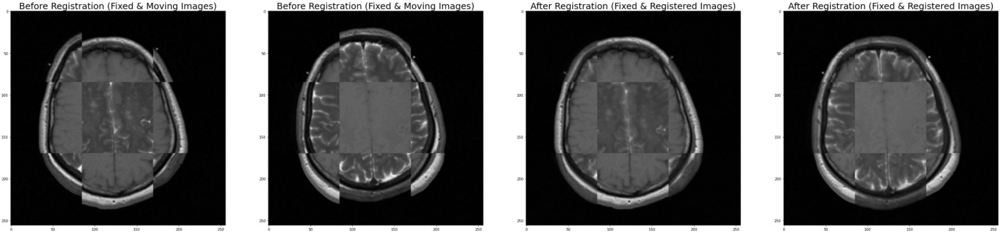
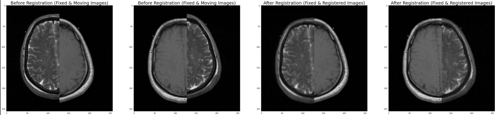

# Image-Registration-with-ITK
This repository contains implementation of a python script to perform image registration on two MRI volumes of different contrast. ITK was used to implement the registration framework and 3D Slicer was used for performance evaluation. Registration framework consists of three distinct components namely, transform, metric and optimizer. For each element, appropriate function was selected based on theoretical explanation and trial-and-error analysis.

## Implementation
The considered MRI volumes are of 2 different MRI modalities, namely T1-Weighted MRI and T2-Weighted MRI. For the task of registration,T1-Weighted MRI volume is used as the Fixed Image to which T2-Weighted MRI volume (Moving Image) is registered. 

### Registration Framework
Following are the components and the corresponding functions utilized for the implemented registration framework.

- Transform : itk.TranslationTransform
```
TransformType = itk.TranslationTransform[itk.D, Dimension]
initialTransform = TransformType.New()

movingInitialTransform = TransformType.New()
initialParameters = movingInitialTransform.GetParameters()
initialParameters[0] = 0
initialParameters[1] = 0
movingInitialTransform.SetParameters(initialParameters)

identityTransform = TransformType.New()
identityTransform.SetIdentity()
```
- Metric : itk.MattesMutualInformationImageToImageMetricv4
```
MetricType = itk.MattesMutualInformationImageToImageMetricv4[FixedImageType, MovingImageType]
metric = MetricType.New()

numberOfBins = 24
metric.SetNumberOfHistogramBins(numberOfBins)
metric.SetUseMovingImageGradientFilter(False)
metric.SetUseFixedImageGradientFilter(False)
```
- Optimizer : itk.RegularStepGradientDescentOptimizerv4
```
optimizer = itk.RegularStepGradientDescentOptimizerv4.New(LearningRate = 4, MinimumStepLength = 0.001, RelaxationFactor = 0.5, NumberOfIterations = 200)
```
- Registration : itk.ImageRegistrationMethodv4
```
registration = itk.ImageRegistrationMethodv4[FixedImageType, MovingImageType].New(FixedImage = fixedImage, MovingImage = movingImage, Metric = metric, Optimizer = optimizer, InitialTransform = initialTransform)

registration.SetMovingInitialTransform(movingInitialTransform)
registration.SetFixedInitialTransform(identityTransform)

registration.SetNumberOfLevels(1)
registration.SetSmoothingSigmasPerLevel([0])
registration.SetShrinkFactorsPerLevel([1])
```

### Optimization


### Visualization of Results





### Slicer 3D Analysis
#### Fixed Image vs Moving Image

#### Fixed Image vs Registered Image

#### Moving Image vs Registered Image
